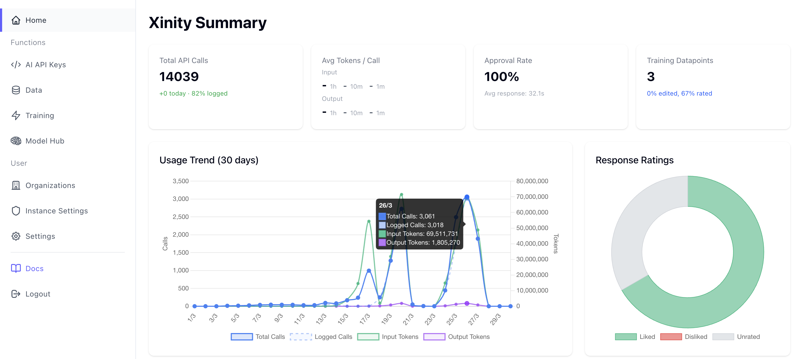
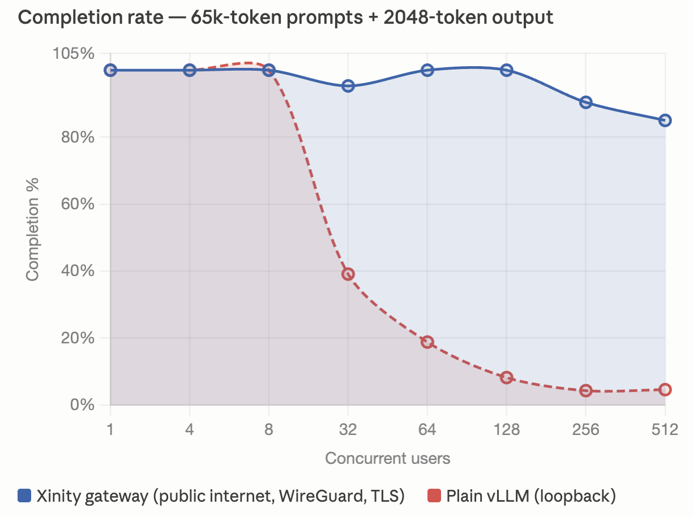

<p align="center">
  
</p>

<h3 align="center">Run AI where your data lives. No exceptions.</h3>

<p align="center">
  The open-source AI platform for enterprises that <em>cannot</em> send data to the cloud:
  not because of preference, but because of law, regulation, or trade secrets.
</p>

<p align="center">
  <a href="https://github.com/xinity-ai/xinity-ai/actions/workflows/tests.yml"></a>
  <a href="#licensing"></a>
  <a href="https://deepwiki.com/xinity-ai/xinity-ai"></a>
  <a href="https://get.xinity.ai/discord"></a>
  <a href="https://github.com/xinity-ai/xinity-ai/stargazers"></a>
  <br/>
  
  
</p>

---

<p align="center"></p>

> **Deployed in production** by regulated enterprises: media companies, manufacturers, and public institutions running AI on their own infrastructure with zero data egress.

---

## Why Xinity exists

Cloud AI assumes your data can leave the building. For many enterprises, it can't, not without violating GDPR, banking secrecy, journalistic source protection, attorney-client privilege, or trade secret law. These organizations aren't cloud-skeptical. They're **sovereignty-blocked**.

Xinity gives them a complete AI platform: model orchestration, an OpenAI-compatible API, a management dashboard, fine-tuning pipelines, and multi-node scaling, that runs entirely on their own hardware. No data leaves. Not to a region. Not to a cloud. Not at all.

**And it's cheaper.** Cloud pricing assumes bursty ~15% utilization. Always-on AI agents run at 80–90%. At that utilization, dedicated on-prem infrastructure delivers roughly **80% cost savings** compared to equivalent cloud capacity. Sovereignty isn't just a compliance requirement, it's an economic advantage. We call this phenomenon, the **Utilization Inversion**.

## See it in action

[](https://asciinema.org/a/quSaPbFf9aqlQcqf)

```bash
# Install the CLI
curl -fsSL https://get.xinity.ai/install.sh | bash

# Set up everything (Postgres, inference engine, dashboard)
xinity up all   # add --target-host to supply a ssh available server to operate on

# Create your admin account right from the terminal (no browser needed)
xinity configure dashboardUrl http://localhost:3100
xinity act onboarding.cli

# Deploy a model (Phi-3 Mini as a quick start example)
xinity act deployment.create '{"name": "Phi-3 Mini", "publicSpecifier": "phi-3-mini", "modelSpecifier": "phi3:mini", "enabled": true}'

# Wait for the model to download and become ready
xinity act deployment.list '{"withStatus": true}'

# Check system health
xinity doctor

# Once the deployment shows "ready", hit your local OpenAI-compatible API:
curl http://localhost:3000/v1/chat/completions \
  -H "Authorization: Bearer sk_..." \
  -H "Content-Type: application/json" \
  -d '{"model": "phi-3-mini", "messages": [{"role": "user", "content": "Hello from on-prem."}]}'
```

Your existing OpenAI SDK code works unchanged, just point the base URL to your Xinity instance.

## How is this different?

| | **Xinity AI** | oLLaMa | LocalAI | vLLM |
|---|---|---|---|---|
| OpenAI-compatible API | ✅ | ✅ | ✅ | ✅ |
| Multi-model orchestration | ✅ | ❌ | Partial | ❌ |
| Multi-GPU orchestration | ✅ | ❌ | ❌ | ✅ |
| Load balancing | ✅ | ❌ | ❌ | ❌ |
| Web dashboard with RBAC | ✅ | ❌ | ❌ | ❌ |
| Enterprise auth (SSO/SAML/2FA) | ✅ | ❌ | ❌ | ❌ |
| Multi-org tenant isolation | ✅ | ❌ | ❌ | ❌ |
| Usage tracking & data collection | ✅ | ❌ | ❌ | ❌ |
| Fine-tuning / distillation pipeline | ✅ | ❌ | ❌ | ❌ |
| MCP server (AI-managed infra) | ✅ | ❌ | ❌ | ❌ |
| EU Governance & Audit trail | ✅ | ❌ | ❌ | ❌ |
| Fully auditable source code | ✅ | ✅ | ✅ | ✅ |

**Xinity isn't a model runner: it's the full operations layer.** Ollama and vLLM are excellent inference engines (Xinity uses them under the hood). Xinity adds everything else an enterprise needs to actually run AI in production: orchestration, access control, observability, and governance.

## Performance under load
 
> The gateway layer adds enterprise features. Does it cost you speed? We measured.

<p align="center"></p>
 
**Setup:** A single NVIDIA DGX Spark (128 GB), Qwen 3.6-35B-A3B-FP8, 120 benchmark scenarios sweeping prompt size (256 – 65 536 tokens), output length (64 – 2 048 tokens), and concurrency (1 – 512 in-flight requests), 31 200 requests per run. The Xinity path traverses the public internet, a WireGuard tunnel, and TLS termination (~60 IP hops); the vLLM baseline runs on loopback.
 
| Metric | Xinity gateway | Plain vLLM (loopback) |
|---|---|---|
| Time-to-first-token p50 / p95 (single stream) | 321 / 512 ms | 265 / 269 ms |
| Per-stream generation rate (p50) | 50.0 tok/s | 50.0 tok/s |
| Peak aggregate throughput | 352 tok/s | 325 tok/s |
| Max validated context length | 262 144 tokens | 262 144 tokens |
| **Completion rate at 512 concurrent × 65k-token prompts** | **85.0 %** (870 / 1024) | **4.6 %** (47 / 1024) |
 
**Why the gateway is _faster_ under load.** The ~56 ms TTFT delta is just the network path; per-stream token rate is identical. Peak aggregate throughput is higher through the gateway because bounded request admission keeps vLLM's scheduler in its efficient operating range. Under sustained overload, bare vLLM emits malformed streaming chunks (`stream_parse` errors), the gateway's internal retry layer catches these and transparently re-dispatches before the client ever sees a failure. The result: **18× higher completion rate** at extreme concurrency, which is the difference between a usable production system and one that falls over.
 
<details>
<summary>Full methodology & data</summary>
Both runs used identical benchmark harness code, identical hardware, and identical model weights. The only variable is the network path.
 
- **Xinity run:** `dev-api.xinity.ai` → public internet → WireGuard → DGX Spark, 2026-05-09 12:18 – 2026-05-10 15:06 UTC
- **vLLM run:** `localhost:11435` → loopback, 2026-05-10 20:04 – 2026-05-11 15:08 UTC
- **Scenarios:** 5 input sizes × 3 output sizes × 8 concurrency levels = 120
- **Requests per scenario:** 32 – 1024 (scaled with concurrency), 31 200 total per run
Full per-scenario reports and aggregate summaries are in [`benchmarks/`](benchmarks/).
 
</details>

## Architecture

```
┌──────────────────────────────────────────────────────────────┐
│                      Your Infrastructure                     │
│                                                              │
│  ┌──────────────┐    ┌──────────────┐    ┌────────────────┐  │
│  │  Dashboard   │◄──►│   Gateway    │◄──►│    Daemon(s)   │  │
│  │  (SvelteKit) │    │  (API proxy) │    │  (GPU nodes)   │  │
│  │              │    │              │    │                │  │
│  │  • RBAC      │    │  • OpenAI-   │    │  • Ollama /    │  │
│  │  • SSO/SAML  │    │    compat.   │    │    vLLM        │  │
│  │  • Usage     │    │  • Routing   │    │  • Model mgmt  │  │
│  │    tracking  │    │  • Rate      │    │  • Auto-scale  │  │
│  │  • MCP       │    │    limiting  │    │                │  │
│  └──────┬───────┘    └──────┬───────┘    └───────┬────────┘  │
│         │                   │                    │           │
│         └─────────┬─────────┘────────────────────┘           │
│                   │                              │           │
│             ┌─────▼──────┐               ┌───────▼────────┐  │
│             │ PostgreSQL │               │  Infoserver    │  │
│             │   + Redis  │               │ (model schema) │  │
│             └────────────┘               └────────────────┘  │
│                                                              │
│               Nothing leaves this box.                       │
└──────────────────────────────────────────────────────────────┘
```

For a detailed architecture walkthrough, see [`docs/architecture.md`](docs/architecture.md).

## Quick start (local development)

**1. Install dependencies**

```bash
# Clone and install dependencies
git clone https://github.com/xinity-ai/xinity-ai.git
cd xinity-ai
bun install
```

> The postinstall hook sets up git commit hooks (commitlint).

**2. Create `.env` files from examples**

```bash
# Initialize .env files from examples (won't overwrite existing)
find . -name 'example.env' -not -path '*/node_modules/*' | while read -r f; do
  target="${f%/example.env}/.env"
  [ -f "$target" ] || cp "$f" "$target"
done
```

This copies each `example.env` to `.env` without overwriting existing files. Review and adjust values as needed. In particular, generate a real secret for `BETTER_AUTH_SECRET` in `packages/xinity-ai-dashboard/.env`:

```bash
openssl rand -base64 33
```

**3. Start infrastructure**

```bash
docker compose up -d
```

This starts Postgres, Redis, and Mailhog. To also start optional services (SearXNG for web search, SeaweedFS for S3 storage), use `docker compose --profile full up -d`.

Verify services are healthy: `docker compose ps`

**4. Run database migrations**

```bash
bun run --cwd packages/common-db migrate
```

**5. Start the infoserver**

```bash
bun run --cwd packages/xinity-infoserver dev
```

The infoserver must be running before the gateway, dashboard, or daemon can start. See the [service dependency table](#service-dependencies) below.

**6. Start the package you want to work on**

See [Package details](#package-details) below for per-package dev commands.

### Service dependencies

| Service | Requires running |
|---|---|
| **Infoserver** | nothing (standalone) |
| **Gateway** | Postgres, Redis, Infoserver |
| **Dashboard** | Postgres, Infoserver, Mailhog (for auth emails) |
| **Daemon** | Postgres, Infoserver, Ollama or vLLM |

Start order: infrastructure (step 3) → migrations (step 4) → infoserver (step 5) → other services (step 6).

### Requirements

- **Bun** ≥ 1.3 (build, package manager, and runtime)
- **Docker + Docker Compose** (local dependencies and container builds)
- **direnv** (recommended for env var loading)

Each package reads its own `.env` file. There is no automatic inheritance from the repo root. The root `.env` is only used by system tests (`bun run test:system`), which need `DB_CONNECTION_URL` and `REDIS_URL`.

Each package's `example.env` is the authoritative source for its variables. Copy it to `.env` and adjust values.

**Key variables by package:**

| Variable | Gateway | Dashboard | Daemon | Infoserver |
|---|---|---|---|---|
| `DB_CONNECTION_URL` | yes | yes | yes | no |
| `REDIS_URL` | yes | no | no | no |
| `INFOSERVER_URL` | yes | yes | yes | no |
| `BETTER_AUTH_SECRET` | no | yes | no | no |
| `MAIL_URL` / `MAIL_FROM` | no | yes | no | no |
| `S3_*` | optional | optional | no | no |

### direnv (optional)

If you use [direnv](https://direnv.net/), create a `.envrc` in each package directory you work in:

```bash
# e.g. packages/xinity-ai-gateway/.envrc
dotenv
```

Run `direnv allow` in that directory after creating the file.

## Deployment

Three production deployment routes, all documented with step-by-step guides:

| Route | Best for | Guide |
|---|---|---|
| **Xinity CLI** ⭐ | Any Linux server with systemd | [`deployment/cli/`](deployment/cli/README.md) |
| **Docker Compose** | Servers with Docker, or cloud VMs | [`deployment/docker/`](deployment/docker/README.md) |
| **NixOS Flake** | NixOS infrastructure | [`deployment/nixos/`](deployment/nixos/README.md) |

> **Note:** The daemon must always run on machines with GPU capacity. Even in Docker or NixOS deployments, the daemon is installed separately on each inference node via the CLI.

See the full [Deployment Guide](deployment/README.md) for the decision tree and multi-node setup.

## Accessing a running instance

All programmatic access uses **dashboard API keys** (Settings → API Keys in the dashboard).

### OpenAI-compatible API

Point any OpenAI SDK or tool at your gateway:

```python
from openai import OpenAI

client = OpenAI(
    base_url="https://your-dashboard/v1",
    api_key="sk_..."
)

response = client.chat.completions.create(
    model="qwen3.5",
    messages=[{"role": "user", "content": "Summarize this contract."}]
)
```

The gateway serves a live, schema-derived API reference at `https://your-xinity-gateway/docs` (rendered with Scalar) and the raw OpenAPI document at `https://your-xinity-gateway-instance/openapi.json`. The dashboard's Documentation page links to it as **Live OpenAPI Spec**.

### Dashboard UI

Web-based admin for managing models, API keys, organizations, and reviewing recorded LLM calls.

### REST API

Every dashboard operation is available programmatically:

```bash
curl -H "x-api-key: sk_..." https://your-dashboard/api/deployment
```

Full API docs live at `https://your-dashboard/api/` with an OpenAPI schema at `/api/openapi.json`.

### MCP Server

Let AI assistants (Claude, Cursor, etc.) manage your infrastructure via natural language:

```json
{
  "mcpServers": {
    "xinity-ai": {
      "url": "https://your-dashboard/mcp",
      "headers": { "Authorization": "Bearer sk_..." }
    }
  }
}
```

### CLI

```bash
xinity up all            # install / configure services
xinity act onboarding.cli  # create admin account from the terminal
xinity act --list-routes # see all available API operations
xinity doctor            # check system health
xinity update            # update the CLI itself
```

## Repo layout

```
packages/
├── common-db/             # Shared DB schema, migrations (Drizzle ORM)
├── common-env/            # Shared env validation (Zod)
├── common-log/            # Shared Pino logger
├── xinity-ai-gateway/     # API gateway (OpenAI-compatible proxy)
├── xinity-ai-dashboard/   # SvelteKit admin dashboard
├── xinity-ai-daemon/      # Model runtime agent (runs on GPU hardware)
├── xinity-cli/            # Operator CLI
└── xinity-infoserver/     # Model registry + YAML server ([model authoring guide](packages/xinity-infoserver/README.md))
```

## Licensing

| Component | License | You can... |
|---|---|---|
| Gateway, Daemon, CLI, Infoserver, DB schema, shared libs | [Apache 2.0](LICENSE) | Use, modify, distribute freely — including commercially |
| Dashboard | [Elastic License v2](packages/xinity-ai-dashboard/LICENSE) | Use and view source. Free tier: 1 org + 1 node. Paid tiers unlock multi-node and multi-org |

The entire codebase is visible and auditable. The open-core engine runs without the dashboard, the dashboard adds enterprise management features on top.

## Troubleshooting

**`bun: command not found`**
Install Bun from [bun.sh](https://bun.sh). This project requires Bun >= 1.3.

**`docker compose` fails or Docker not found**
Install [Docker Engine](https://docs.docker.com/engine/install/) with the Compose plugin (or Docker Desktop).

**Port already in use (5432, 6379, etc.)**
Another process is using that port. Check with `lsof -i :5432` and stop the conflicting process, or adjust ports in `compose.yaml`.

**Migration fails with connection error**
Ensure Docker Compose is running (`docker compose ps`). The `db` service must be healthy before running migrations.

**`BETTER_AUTH_SECRET` error on dashboard startup**
Generate a secret and set it in `packages/xinity-ai-dashboard/.env`:
```bash
openssl rand -base64 33
```

**`bun2nix` is slow or fails during install**
This runs in the postinstall hook for NixOS support. Run `CI=1 bun install` to skip it.

<details>
<summary><strong>Licensing FAQ</strong></summary>

**Can I use it for free?**
Yes. The engine (gateway, daemon, CLI, infoserver, DB layer) is Apache 2.0 with no restrictions. The dashboard free tier supports one organization and one inference node — enough to evaluate or run smaller deployments.

**Can I audit the system?**
Yes. Every line of code is here and intended to be auditable. That's the point.

**What does the paid dashboard unlock?**
Multi-node orchestration (2, 6, 20+ nodes), multi-org tenant isolation, and additional enterprise features. Pricing starts with an affordable startup tier.

</details>

## Contributing

We'd love your help. Whether it's bug reports, documentation improvements, or new features, contributions are welcome.

```bash
# Good places to start:
# 1. Issues labeled "good first issue"
# 2. Documentation gaps you notice while setting up
# 3. Integrations with inference engines beyond Ollama/vLLM
```

Please read [`CONTRIBUTING.md`](CONTRIBUTING.md) before opening a PR — it covers scope, review expectations, and how to propose changes.

**Join the community:** [Discord](https://discord.gg/xinity) · [Discussions](https://github.com/xinity-ai/xinity-ai/discussions)

## Roadmap

See the [public roadmap](https://github.com/orgs/xinity-ai/projects/1) for what's coming next. Key areas:

- 🔬 Distributed split inference (MoE across nodes with privacy-preserving encoding)
- 🔄 One-click migration from OpenAI / Azure OpenAI
- 📊 Advanced usage analytics and cost attribution
- 🇪🇺 EU compliance reporting templates (GDPR, EU AI Act, NIS2, ...)

## Security

To report a vulnerability, follow the process in [SECURITY.md](SECURITY.md). Do not open a public issue.

## Common workflows

<details>
<summary>Click to expand</summary>

```bash
# Local dependencies
docker compose up -d          # start
docker compose down           # stop
docker compose down -v        # reset (drop all state)

# Database
cd packages/common-db
bun run migrate               # apply migrations
bun run migrate:gen           # regenerate migrations
bun run inspect               # inspect schema

# Run all tests across all packages
bun run test

# System tests only (requires running dependencies)
bun run test:system

# Build Docker images
docker compose -f docker/build.compose.yaml build gateway
docker compose -f docker/build.compose.yaml build dashboard
docker compose -f docker/build.compose.yaml build xinity-infoserver
```

### Docker Compose services

| Service | Port | Purpose |
|---|---|---|
| `db` | 5432 | PostgreSQL 17 |
| `redis` | 6379 | Redis 7 |
| `mailhog` | 1025 / 8025 | Local SMTP + UI |
| `searxng` | 6148 | Web search |
| `seaweedfs` | 8333 | S3-compatible storage |

### Testing

Tests use [Bun's built-in test runner](https://bun.sh/docs/cli/test). Most packages define a `test` script in their `package.json`:

```bash
bun run test:system       # system integration tests (requires DB + Redis)
```

Per-package tests can be run from within the package directory:

```bash
cd packages/xinity-ai-gateway && bun run test
cd packages/xinity-cli && bun run test
```

Dashboard tests have additional prerequisites — see the [dashboard README](packages/xinity-ai-dashboard/README.md#testing) for details.

</details>

---

<p align="center">
  <strong>Contracts are paper. Infrastructure is reality.</strong><br/>
  <sub>Built in Vienna. Open to the world.</sub>
</p>
