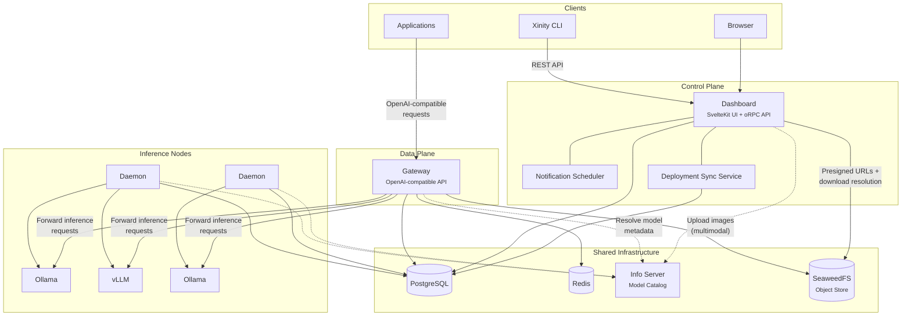
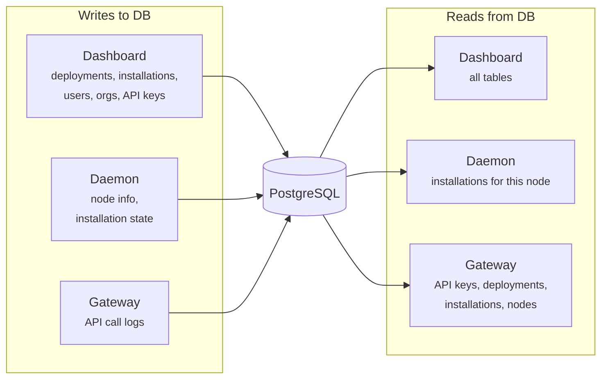
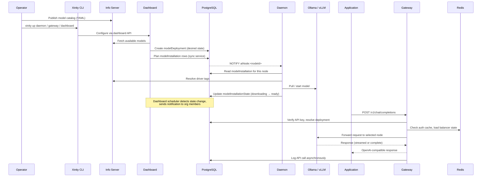

# Architecture

## Overview

Xinity AI is a self-hostable platform for managing and serving specialized AI models on-premises. The system lets organizations deploy, monitor, and query LLMs through an OpenAI-compatible API while maintaining full control over their data and infrastructure.

The architecture follows a shared-database pattern: all services coordinate through a common PostgreSQL schema rather than direct service-to-service calls. This keeps each service thin and independently deployable while ensuring consistency.

## System diagram

## Components

### Dashboard

**Package:** `packages/xinity-ai-dashboard` | **Runtime:** SvelteKit 2 + Svelte 5, compiled to a self-contained binary (Bun runtime embedded)

The dashboard is the central management surface. It serves three distinct roles within a single process:

**User interface:** A web application for administrators and operators. Provides management of users and organizations, viewing and labeling inference data, creating and monitoring model deployments, configuring API keys and applications, and SSO/2FA setup.

**API server:** An oRPC-based API served at two endpoints: `/rpc/[...rest]` (JSON-RPC, used by the frontend) and `/api/[...rest]` (OpenAPI-compatible REST, used by the CLI and external integrations). Procedures cover the full management surface: API keys, applications, deployments, organizations, users, SSO, data labeling, and onboarding.

**Background services:** Two long-running processes start alongside the dashboard server:

- *Deployment sync service:* Runs on startup and every 5 minutes. Reads enabled deployments (desired state), compares against existing model installations (actual state), and plans new installations or removals using a first-fit bin-packing strategy across available nodes. Writes changes to the `modelInstallation` table, which daemons then act on. Triggered immediately on deployment create/update/delete.

- *Notification scheduler:* Polls every 5 minutes and fires notifications based on system state transitions: deployment readiness or failure, node online/offline status changes, capacity warnings (when usage exceeds 80% of available capacity), and a weekly usage report (sent Monday mornings with deployment counts, node counts, API call volumes, and top models).

**MCP server:** The dashboard exposes a [Model Context Protocol](https://modelcontextprotocol.io) endpoint at `/mcp`, allowing AI assistants (Claude, Cursor, Windsurf) to manage deployments, applications, API keys, and other resources via natural language. The MCP server dynamically generates its tool list from oRPC procedures at startup — any procedure not explicitly excluded is automatically available as an MCP tool. Security-sensitive operations (credential management, SSO configuration, organization deletion, instance admin) are excluded. Authentication uses the same API keys as the REST API. The endpoint can be disabled with `MCP_ENABLED=false`.

Auth is handled by Better Auth with plugins for 2FA (TOTP), passkeys (WebAuthn), SSO (OIDC/SAML), API keys, and multi-tenant organizations. Five roles control access: owner, admin, member, labeler, and viewer.

### Gateway

**Package:** `packages/xinity-ai-gateway` | **Runtime:** Bun native HTTP server

The gateway is the data-plane entry point for all inference traffic. It exposes an OpenAI-compatible API surface:

- `POST /v1/chat/completions`: Chat (streaming and non-streaming)
- `POST /v1/completions`: Legacy text completions
- `POST /v1/embeddings`: Embedding generation
- `POST /v1/rerank`: Reranking
- `GET /v1/models`: List available models
- `POST /v1/responses`: Responses API (with persistent store)

**Request flow:**

1. **Authentication:** The `Authorization: Bearer <key>` header is parsed. The first 25 characters are used as a specifier for fast lookup (cached in Redis for 1 hour). The full key is verified against a bcrypt hash stored in the database.
2. **Model resolution:** The requested model name is resolved through the `modelDeployment` table to determine the actual model specifier. For canary deployments, the gateway probabilistically routes between the current and canary model based on time-interpolated progress.
3. **Host selection:** Available inference nodes are fetched from `modelInstallation` joined with `aiNode`. A load balancer selects the target host using one of three strategies: random, round-robin, or least-connections (default). Session affinity ensures a given API key consistently routes to the same canary variant.
4. **Image extraction:** For multimodal requests containing image content, each image is extracted and uploaded to SeaweedFS (when configured). The SHA-256 hash of the raw bytes serves as the S3 key and deduplication identifier. A compact `xinity-media://{sha256}` reference is stored in the database log, while the inference node always receives full data URIs. External image URLs are fetched and resolved to data URIs before forwarding. When SeaweedFS is not configured, data URIs are stripped from the database log and external URLs are stored as-is.
5. **Forwarding:** The request is forwarded to the selected inference node's LLM driver (Ollama or vLLM) via the Vercel AI SDK.
6. **Logging:** On completion, the request is logged asynchronously to the `apiCall` table for usage tracking and data labeling.

**Redis** is used for: authentication caching, load balancer state (counters, connection gauges, affinity keys), and the responses API store.

### Daemon

**Package:** `packages/xinity-ai-daemon` | **Runtime:** Bun, runs on each inference node

The daemon is a lightweight process that runs on every machine with inference hardware. It is the bridge between the desired state in the database and the actual state of model installations on the node.

**Node registration:** On startup, the daemon detects the hardware profile of the machine. It probes for NVIDIA GPUs (via `nvidia-smi`), AMD GPUs (via sysfs or `rocm-smi`), and Intel GPUs (via `xpu-smi`). Total VRAM across all GPUs becomes the node's estimated capacity. If GPUs are found but report no VRAM (unified memory architectures), system RAM is used instead. With no GPUs, the node runs in CPU-only mode. The daemon registers or updates its `aiNode` record in the database with the host address, available drivers, GPU count, and capacity.

**Model lifecycle management:** The daemon runs a sync loop (RxJS-based, every 5 minutes by default) that:

1. Reads `modelInstallation` rows assigned to this node from the database.
2. Compares desired installations against what is actually running locally.
3. For **Ollama**: pulls missing models (streaming progress to `modelInstallationState`), removes models no longer needed. Supports 2 concurrent pulls.
4. For **vLLM**: manages model instances via systemd template units or Docker containers. Starts new instances, stops stale ones, and polls health endpoints until the model is ready (up to 1 hour timeout). Fires a warmup request on readiness to pre-compile Triton kernels.
5. Reports lifecycle state (`downloading` → `installing` → `ready` / `failed`) back to `modelInstallationState` in the database.

The daemon also subscribes to PostgreSQL `NOTIFY` on channel `aiNode:<nodeId>`, allowing the dashboard to trigger immediate resync after deployment changes rather than waiting for the next poll interval.

### Xinity CLI

**Package:** `packages/xinity-cli` | **Runtime:** Standalone compiled binary

The CLI is the operator's tool for installing, configuring, and managing Xinity services on Linux hosts. Key capabilities:

- **`xinity up <component>`**: Installs or updates gateway, dashboard, daemon, infoserver, or database. Handles the full lifecycle: downloads the binary from GitHub Releases with SHA256 verification, prompts for environment configuration (reading Zod schemas from each component's `env-schema.ts`), generates systemd unit files with security hardening, and starts the service. Supports `--target-host` for remote installation over SSH. The `db` subcommand also bundles Redis discovery after running Postgres migrations.
- **`xinity up infra-<tool>`**: Infrastructure setup utilities for dependencies like Redis, SeaweedFS, Postgres, and Ollama. These handle detection, installation, service management, and configuration. For example, `infra-ollama` installs ollama, configures it to listen on the network, tests the endpoint, and writes `XINITY_OLLAMA_ENDPOINT` into the daemon env file.
- **`xinity rm <component>`**: Cleanly removes a component (stops service, removes unit file, binary, and config). Preserves secrets that are still needed by other installed components.
- **`xinity update`**: Self-updates the CLI binary.
- **`xinity act [route] [data]`**: Calls any dashboard API route directly. Dynamically discovers available routes by loading the dashboard's oRPC router at runtime. Supports interactive schema-driven prompts when data is omitted.
- **`xinity configure`**: Manages CLI settings or interactively reconfigures components when run as `xinity configure <component>`.

The CLI generates systemd units with a security-conscious split: non-secret environment variables go into a readable env file, while secrets (annotated with `.meta(secret())` in the schema) are stored in mode-600 files and loaded via systemd's `LoadCredential`.

### Common DB

**Package:** `packages/common-db`

The shared database layer. Contains the Drizzle ORM schema, migrations, and utilities that every other service depends on. Key tables include:

| Table | Purpose |
|---|---|
| `user`, `account`, `session` | Better Auth identity and session management |
| `organization`, `member`, `invitation` | Multi-tenant organization structure |
| `aiApiKey` | Gateway API keys (specifier prefix + bcrypt hash) |
| `aiApplication` | Named application groupings for API keys |
| `modelDeployment` | Desired state: which models should be available, with canary controls |
| `aiNode` | Registered inference nodes with capacity, drivers, and availability |
| `modelInstallation` | Planned model instances per node (written by dashboard, read by daemons) |
| `modelInstallationState` | Actual lifecycle state per installation (written by daemons, read by dashboard) |
| `apiCall` | Logged inference requests (in `call_data` schema) |
| `apiCallResponse` | User feedback and labels on logged calls |
| `mediaObject` | Metadata for images uploaded to SeaweedFS: sha256, mimeType, s3Key, org scoping (in `call_data` schema) |

The package also provides `preconfigureDB()`, which returns lazy database access with a migration check gate, so services cannot query the database until migrations are confirmed up to date.

### SeaweedFS

**External service** | **Managed by:** `xinity up infra-seaweedfs`

SeaweedFS is an optional self-hosted S3-compatible object store used for multimodal image storage. It replaces the alternative of embedding base64 image data directly in the PostgreSQL `apiCall.inputMessages` JSONB column, which would cause significant database bloat.

When `S3_ENDPOINT` is configured in the gateway:

- Incoming image content (data URIs and external URLs) is uploaded to SeaweedFS, keyed by the SHA-256 hash of the raw bytes.
- The database stores a compact `xinity-media://{sha256}` reference inside the existing `image_url` content part.
- Inference nodes always receive full data URIs (external URLs are fetched and resolved before forwarding).
- The `mediaObject` table records sha256, MIME type, S3 bucket/key, organization ID, and byte size. The unique constraint on `(organizationId, sha256)` provides content-addressed deduplication.

The dashboard resolves `xinity-media://` references:
- **Display:** A server-side `/api/media/[sha256]` endpoint generates a short-lived presigned URL (15 minutes) and returns a 302 redirect.
- **Export:** The `/api/call-export/[callId]` endpoint resolves references to data URIs before serializing, producing fully self-contained JSON downloads.

SeaweedFS ships as a single static `weed` binary with no external dependencies. It is installed and managed via `xinity up infra-seaweedfs`, which downloads the binary, writes an S3 identity config to `/etc/xinity-ai/seaweedfs-s3.json`, installs a systemd unit, and starts the service. The gateway can also function without SeaweedFS configured, in which case, data URIs are stripped from call logs entirely and external URLs are stored as-is.

### Info Server

**Package:** `packages/xinity-infoserver` | **Runtime:** Bun HTTP server, stateless

A model catalog service that publishes metadata about available models. Reads from a YAML catalog file (with support for recursive remote includes) and serves it as both YAML and JSON. Each model entry includes name, description, weight size, minimum KV cache, type (chat/embedding/rerank), supported drivers with driver-specific model strings, and tags (e.g. `tools`, `vision`, `custom_code`).

Consumed by the gateway (to resolve model types and driver tags), the daemon (to check tags like `custom_code` for vLLM `--trust-remote-code`), and the dashboard (to display available models for deployment). All consumers use a shared client with in-memory TTL caching.

## How services connect

There are no direct service-to-service calls between the gateway, dashboard, and daemon. All coordination flows through the shared PostgreSQL database:

- **Dashboard → Daemon**: The dashboard writes `modelInstallation` rows (planned state). The daemon's sync loop reads these and drives local drivers to match. PostgreSQL `NOTIFY` provides low-latency push when changes are made.
- **Daemon → Dashboard**: The daemon writes `modelInstallationState` (actual lifecycle state) and `aiNode` (hardware availability). The dashboard reads these for status display, orchestration planning, and notification triggers.
- **Gateway → Database**: The gateway reads `aiApiKey` for authentication, `modelDeployment` for model resolution, and `modelInstallation`/`aiNode` for host selection. It writes `apiCall` logs for usage tracking.
- **Redis** is used exclusively by the gateway for ephemeral state: auth caching, load balancer coordination, and the responses API store.
- **Info server** is consumed over HTTP by all three services for model metadata resolution, with each consumer maintaining its own in-memory cache.
- **SeaweedFS** (optional) is written to by the gateway on every multimodal request and read by the dashboard for image display (presigned URLs) and call export (data URI resolution). No other services interact with it directly.

## Model deployment lifecycle

